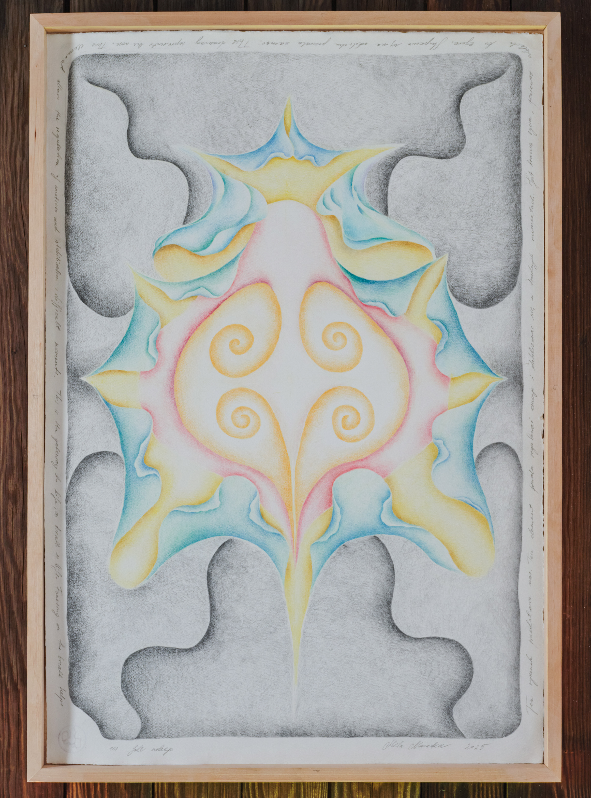

# About

Mila Nowacka is a multimedia artist, art history graduate and mother. Her practice explores the relationship between the body, perception, and environment recently focusing on drawing. She employs feedback phenomena, error, and sensory experience as both research and creative tools. Images that she creates explore the entanglement of internal states with external stimuli, offering visual and conceptual reflections on the balance of systems—biological, natural, and technological. She is particularly interested in the cycles of imbalance and return to stability—processes present in every system and deeply affected by human behavior. Currently, she is working on a series of drawings that visualize her own body from within, exploring the sensations associated with individual internal organs. Former co-creator of the audiovisual duo WIDT, audiovisual band TEYAS and musical duo Mentos Gulgendo.

EXHIBITIONS 

27.09-15.10 - Nowelia Kiliani, Garden Gallery, Warsaw
14.06–7.07.2024 – Serce Exhib, Warsaw, PL / Do Flowers Look at Bees?, curator: Kamil Pierwszy
27–28.08.2023 – Turnus Gallery, Warsaw, PL / IRIDISUNTO
18–19.06.2022 – Karowa Gallery, Warsaw, PL, Mila Nowacka: Presentation of Works and Types of Feedback Loops in Audio-Video Devices
8–10.12.2021 – Pracownia Wschodnia, Warsaw, PL / Satin Made of Triggers

VIDEO SHOWS

8.02.2026 - Feedback Loop (2026), Sauna Festival, Warsaw, curated by Weronika Adamowska
20.09.2025 - Aqualines (2025), Her Docs Festival, Warsaw
1-21.10.2025 - Screening of the film TEYAS as part of the Sprzężenia/Feedback cycle, curated by Weronika, Foundation for Polish Art ING, Warsaw, Poland
8.02.2025 - Aqualines (2025), Singletary Center for the Arts Visual Music Festival, Kentucky, USA
18.09.2022 - WIDT 2020, Zachęta & HER Docs, Women’s Video Art and Discussion, Warsaw, Poland
29-31.07.2021 - WIDT 2020, Contexts Festival, Sokołowsko, Poland
26.10.2019 - TEYAS, BWA, Warsaw, Poland

EDUCATION

2010-2013 - Art History, master’s thesis:
“The Phenomenon of Glitch Art in the Context of the History of the
Image”, supervisor: Prof. Dr. Hab. Dorota Folga Januszewska
2007-2010 - Art History, bachelor’s degree

[e-mail](mailto:milannowacka@gmail.com) 
[instagram](www.instagram.com/milanowacka/?hl=en)

# Projects
## Thyroid

### Description
from Feedback series 
wax-based color pencils on cotton paper
78 x 53 cm 
2024

This is a visualisation of the thyroid during a painful break up. It shines because it is regenerating. It needs support. Small steps are crucial.

photo: Kasia Rysiak

## Head

### Description
from Feedback series 
wax-based color pencils on cotton paper
78 x 53 cm
2024

This drawing expresses the desire to be both a warm, emotionally supportive mum and a protector and provider for the child. I try to intergrate those aspects as a layered form of being - many heads in constant motion. 

photo: Kasia Rysiak

## Spine

### Description
from Feedback series 
wax-based color pencils on cotton paper
78 x 53 cm 
2024

This drawing represents the manifestation of the spine in all its magnificent strengh. The spine is our center of movement - a fundamental element in our everyday existance. It is depicted here in colors symbolising the various chackras within us. 

photo: Bartosz Górka

## Nose 

### Description
from Feedback series 
wax-based color pencils on cotton paper
78 x 53 cm 
2024

This drawing represents nose. This element allows for the regulation of emotions and stabilisation in difficult moments. It is the gateway to life, as breath is life. Focusing on the breath helps to fall asleep. 

photo: Bartosz Górka

## Urinary system 

### Description
from Feedback series
wax-based color pencils on paper
200 x 100 cm
2025

This image is a vision of the urinary system. Kidneys are the power center in our body - they play a crucial role in our lives. The kidneys like the warmth. As an infant my son strugled with an issue within his urinary system, grade IV ureteral wall thickening, his kidneys were in danger, because of the constantly recurring inflamations. For several years he was under the care of the doctors of the Center of Mother and Child in Warsaw. Currently he is healthy. 

Bartosz Górka

## Stimulus

### Description
wax-based color pencils on old paper in vintage photo frame 
11 x 8 cm
2025

photo: Bartosz Górka

## CREATURE stage I

### Description
from Nowelia Kiliani Series 
[link](https://milanowacka.bandcamp.com/album/nowelia-kiliani)

wax-based colored pencils on cotton paper
100 x 70 cm
2021 

photo: Kasia Rysiak

## CREATURE stage II

### Description 
from Nowelia Kiliani Series 
[link](https://milanowacka.bandcamp.com/album/nowelia-kiliani)

wax-based color pencils on cotton paper
100 x 70 cm
2022

photo: Kasia Rysiak

## CREATURE stage III

### Description 
from Nowelia Kiliani Series 
[link](https://milanowacka.bandcamp.com/album/nowelia-kiliani)

wax-based color pencils on bristol
100 x 70 cm
2022

photo: Kasia Rysiak

## CREATURE stage IV

### Description 
from Nowelia Kiliani Series 
[link](https://milanowacka.bandcamp.com/album/nowelia-kiliani)

wax-based color pencils on bristol
100 x 70 cm
2022

photo: Kasia Rysiak

## CREATURE stage VI

### Description 
from Nowelia Kiliani Series 
[link](https://milanowacka.bandcamp.com/album/nowelia-kiliani)

wax-based color pencils on cotton paper
70 x 50 cm
2023

photo: Kasia Rysiak

## CREATURE stage VII

### Description 
from Nowelia Kiliani Series 
[link](https://milanowacka.bandcamp.com/album/nowelia-kiliani)

wax-based color pencils on cotton paper
100 x 70 cm
2023

photo: Kasia Rysiak

## CREATURE stage VIII

### Description 
from Nowelia Kiliani Series 
[link](https://milanowacka.bandcamp.com/album/nowelia-kiliani)

wax-based color pencils on cotton paper
100 x 70 cm
2023

photo: Kasia Rysiak

## CREATURE stage X

### Description 
from Nowelia Kiliani Series 
[link](https://milanowacka.bandcamp.com/album/nowelia-kiliani)

wax-based color pencils on military technical paper
100 x 70 cm
2024

photo: Kasia Rysiak

