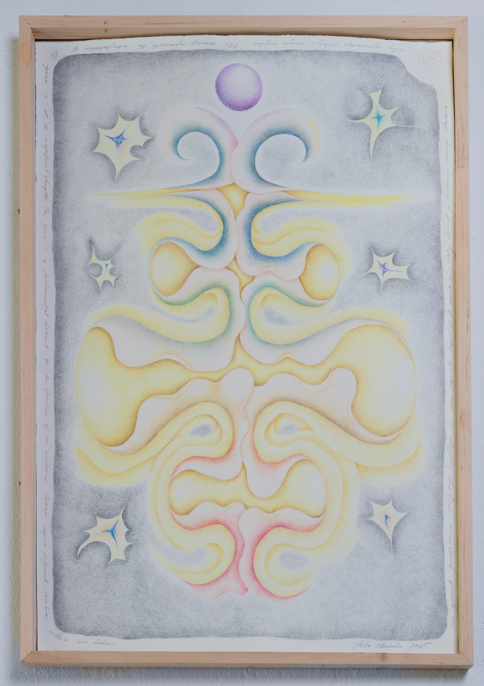

# About
Hej jestem bobulus sanktus prajm. Najlepsza baberka w kosmosie.

[Kliknij tutaj](mailto:milanowacka@gmail.com) żeby wysłać do mnie maila.

[Link do innej strony](https://transientlab.net)

# Projects
## Thyroid, from Feedback series 

### Description
78 x 53 cm 
2024

This is a visualisation of the thyroid during a painful break up. It shines because it is regenerating. It needs support. Small steps are crucial.

photo: Kasia Rysiak

## Head

### Description
from Feedback series 
78 x 53 cm
2024

This drawing expresses the desire to be both a warm, emotionally supportive mum and a protector and provider for the child. I try to intergrate those aspects as a layered form of being - many heads in constant motion. 

photo: Kasia Rysiak

## Spine

### Description
from Feedback series 
78 x 53 cm 
2024

This drawing represents the manifestation of the spine in all its magnificent strengh. The spine is our center of movement - a fundamental element in our everyday existance. It is depicted here in colors symbolising the various chackras within us. 

photo: Bartosz Górka

## Nose 

### Description
from Feedback series 
78 x 53 cm 
2024

This drawing represents nose. This element allows for the regulation of emotions and stabilisation in difficult moments. It is the gateway to life, as breath is life. Focusing on the breath helps to fall asleep. 

photo: Bartosz Górka

## Urinary system 

### Description
from Feedback series
200 x 100 cm
2025

This image is a vision of the urinary system. Kidneys are the power center in our body - they play a crucial role in our lives. The kidneys like the warmth. As an infant my son strugled with an issue within his urinary system, grade IV ureteral wall thickening, his kidneys were in danger, because of the constantly recurring inflamations. For several years he was under the care of the doctors of the Center of Mother and Child in Warsaw. Currently he is healthy. 

Bartosz Górka

## Stimulus

### Description
11 x 8 cm 
2025

photo: Bartosz Górka

## Uber dzieło sztuki poważnej

### Description
Tutaj piszesz opis.
Ten opis może zawierać [link](https://google.com/)

## Głowa

### Description
60 x 80 cm 
2026

Praca powstała w ramach serii Sprzężenie Zwrotne. 
Jest to wizualizacja głowy samodzielnej mamy.