# About

I am an artist, art history graduate and mother. My practice explores the relationship between the body, perception, and environment, recently focusing on drawing. I work with feedback phenomena, error, and sensory experience as both research and creative tools. Images that I create explore the entanglement of internal states with external stimuli, incorporating visual and conceptual reflections on the balance of systems - biological and technological. I am particularly interested in the cycles of imbalance and return to stability - processes present in every system and deeply affected by human behavior. Currently, I am working on a series of drawings that visualize my own body from within, exploring the sensations associated with individual internal organs. Former co-creator of the audiovisual duo WIDT, audiovisual band TEYAS and musical duo Mentos Gulgendo.

EXHIBITIONS 

27.09-15.10 - Nowelia Kiliani, Garden Gallery, Warsaw
14.06–7.07.2024 – Serce Exhib, Warsaw, PL / Do Flowers Look at Bees?, curator: Kamil Pierwszy
27–28.08.2023 – Turnus Gallery, Warsaw, PL / IRIDISUNTO
18–19.06.2022 – Karowa Gallery, Warsaw, PL, Mila Nowacka: Presentation of Works and Types of Feedback Loops in Audio-Video Devices
8–10.12.2021 – Pracownia Wschodnia, Warsaw, PL / Satin Made of Triggers

PUBLICATIONS

[The Drawing Stall Vol 2: Compendium of Colored Pencil](https://the-drawing-stall.bigcartel.com/product/the-drawing-stall-vol-2)
[Muzeum jutra - cyfrowe modele i artefakty, FRSK](https://www.mapasztuki.pl/muzeum-jutra/artistution)

VIDEO SHOWS

8.02.2026 - Feedback Loop (2026), Sauna Festival, Warsaw, curated by Weronika Adamowska
20.09.2025 - Aqualines (2025), Her Docs Festival, Warsaw
1-21.10.2025 - Screening of the film TEYAS as part of the Sprzężenia/Feedback cycle, curated by Weronika Zalewska, Foundation for Polish Art ING, Warsaw, Poland
8.02.2025 - Aqualines (2025), Singletary Center for the Arts Visual Music Festival, Kentucky, USA
18.09.2022 - WIDT 2020, Zachęta & HER Docs, Women’s Video Art and Discussion, Warsaw, Poland
29-31.07.2021 - WIDT 2020, Contexts Festival, Sokołowsko, Poland
26.10.2019 - TEYAS, BWA, Warsaw, Poland

EDUCATION

2010-2013 - Art History, master’s thesis:
“The Phenomenon of Glitch Art in the Context of the History of the
Image”, supervisor: Prof. Dr. Hab. Dorota Folga Januszewska
2007-2010 - Art History, bachelor’s degree

[e-mail](mailto:milannowacka@gmail.com) 
[instagram](https://www.instagram.com/milanowacka)

artwork documentation: Kasia Rysiak, Bartosz Górka

.

# Projects
## Grandmother Mother Doughter
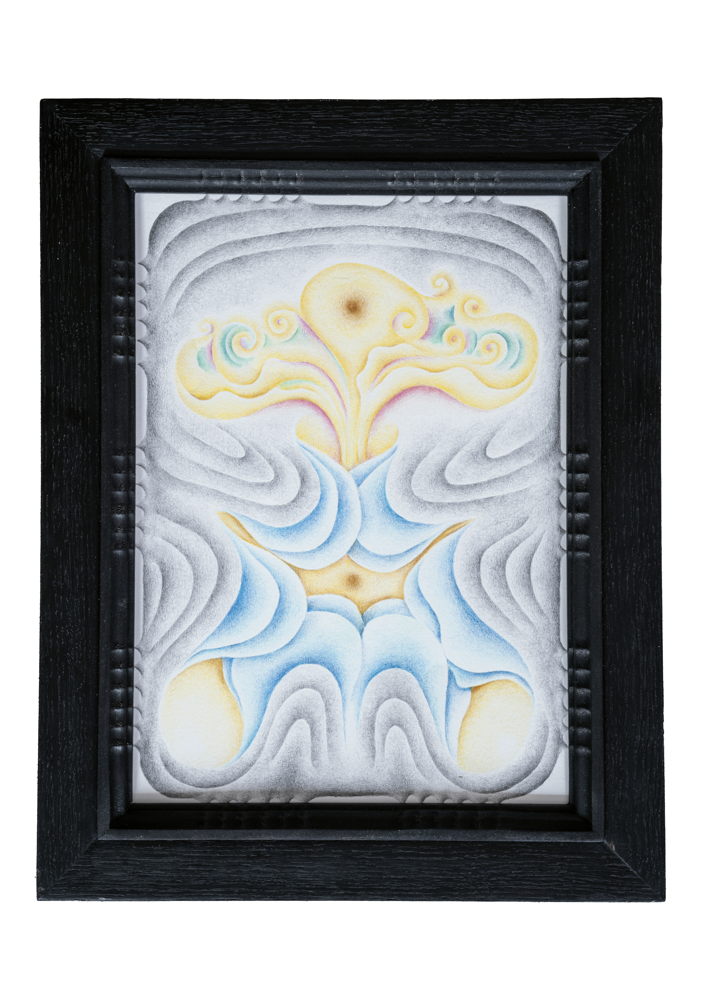
### Description
from Feedback series 
wax-based color pencils on cotton paper
Black oack frame
20 x 30 cm 
2024

## Thyroid
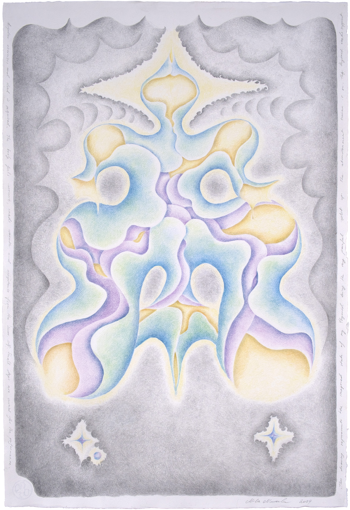
### Description
from Feedback series 
wax-based color pencils on cotton paper
78 x 53 cm 
2024

This drawing depicts an imagined state of my thyroid while struggling with family related situations. The thyroid was in need of support. Regular exercise and proper nutrition are essential. The body feels uncertain and longs for warmth generated from within. Small steps are key to its proper functioning. 

The Feedback is a series of drawings that serve as a visual manifestation of my internal bodily and emotional processes. Each image is created as a result of deep introspection and embodied perception, both internal and external. The drawings constitute a personal record of the phenomenon of feedback, an interpretation of the mechanism known from electronic systems, here translated into the language of corporeality. Each drawing is accompanied by an original text, which forms an integral part of the work. 

## Head
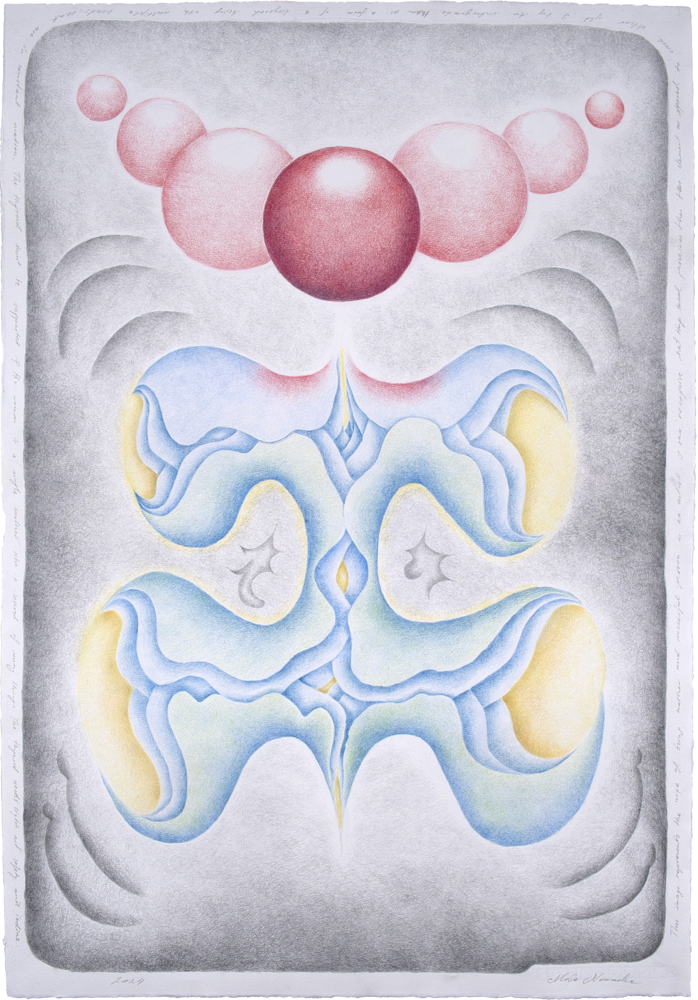
### Description
from Feedback series 
wax-based color pencils on cotton paper
78 x 53 cm
2024

This image reflects the desire to be both a mother, caregiver, and a provider at the same time. I realize that my mind perceives these two roles as conflicting, yet I attempt to integrate them into a layered form of being - many heads in constant motion. If a woman is a single mother and carries many fears, the head needs the support of the spine. 

Beyond the notion of feedback as a creative method, my practice draws on traditions developed by artists associated with the Theosophical Society, who attempted to give visual form to invisible forces, sensations, and states of consciousness.

## Spine
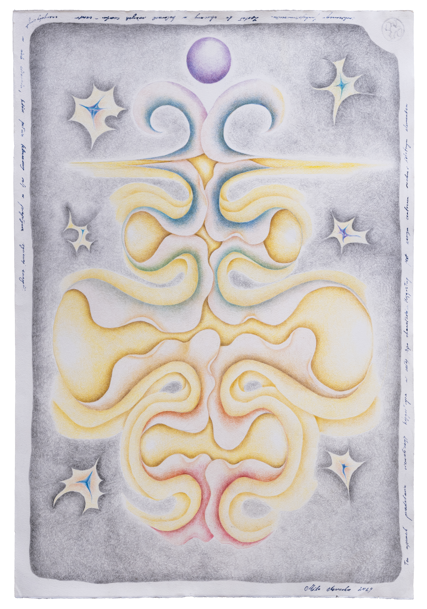
### Description
from Feedback series 
wax-based color pencils on cotton paper
78 x 53 cm 
2024

This drawing represents the manifestation of the spine in all its magnificent strengh. The spine is our center of movement - a fundamental element in our everyday existance. It is depicted here in colors symbolising the various chackras within us. 

During the process, I focused on internal feelings and emotional responses in relation to information gathered through Traditional Chinese Medicine (TCM), attempting to translate these stimuli into form. The decision-making process was encoded within the body itself: once a gesture, movement of the hand, or emerging shape felt familiar, intuitive, and correct, I continued to develop it further.

## Nose 
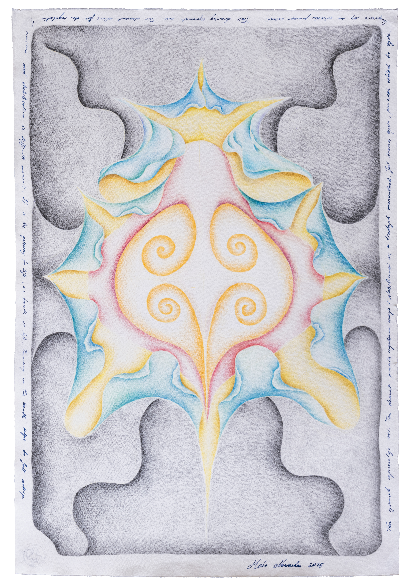
### Description
from Feedback series 
wax-based color pencils on cotton paper
78 x 53 cm 
2025

This drawing represents nose. This element allows for the regulation of emotions and stabilisation in difficult moments. It is the gateway to life, as breath is life. Focusing on the breath helps to fall asleep. 

I was deeply inspired by the emergence of contemporary scientific movements and manifestos that advocate for new methodologies within scientific discourse, such as new materialism, post-materialism, and posthumanist perspectives. These approaches, often closely connected to feminist theory, propose alternative ways of understanding matter, consciousness, embodiment, and the relationships between humans and non-human entities.

I view these movements, and their recognition of all living beings as deeply interconnected, as the emergence of a new paradigm - one that holds the potential to transform, or even heal, the profound wounds of our contemporary world, shaped by ongoing ecological and political crises.

## Brain 
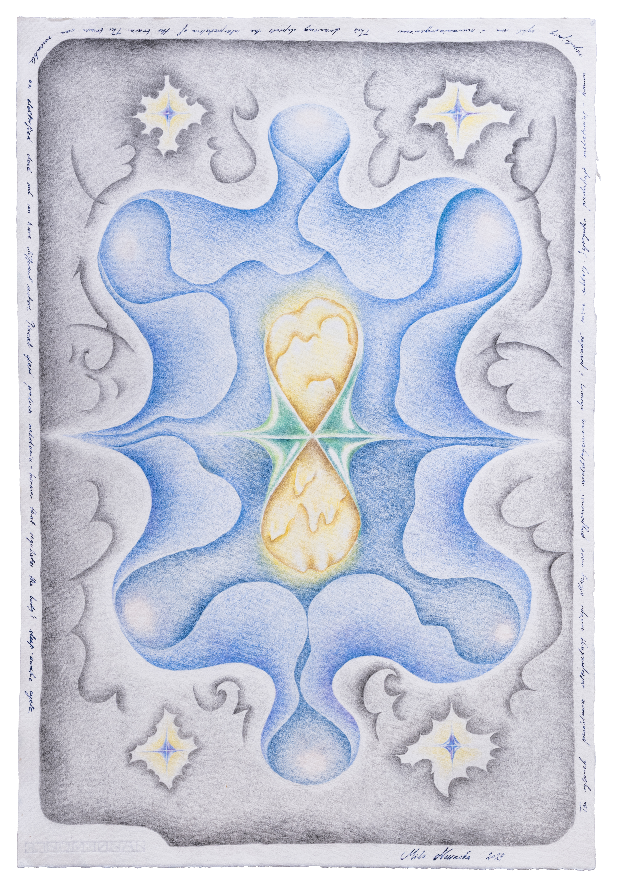
### Description
from Feedback series 
wax-based color pencils on cotton paper
78 x 53 cm 
2024

Brain can be represented by electrified cloud, in the middle there is a representation of the pineal gland, which is responsible for melatonine production. This hormon regulates the sleep-awake cycle.

## Mouth 
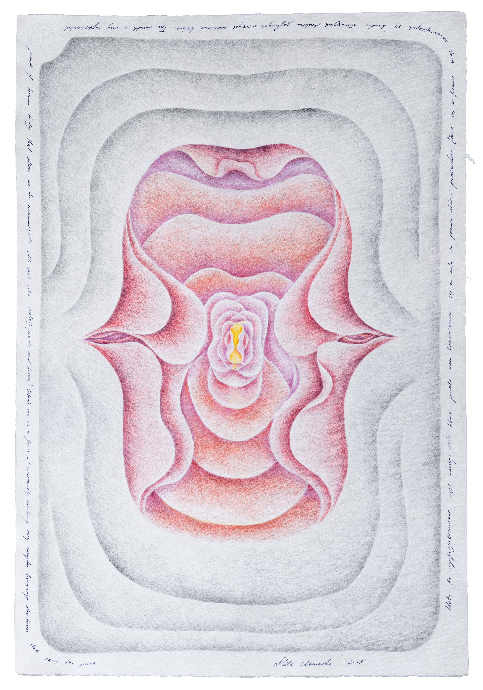
### Description
from Feedback series 
wax-based color pencils on cotton paper
78 x 53 cm 
2025

Mouth is an organ that helps us-humans communicate in a form of words and kissing.

## Heart 
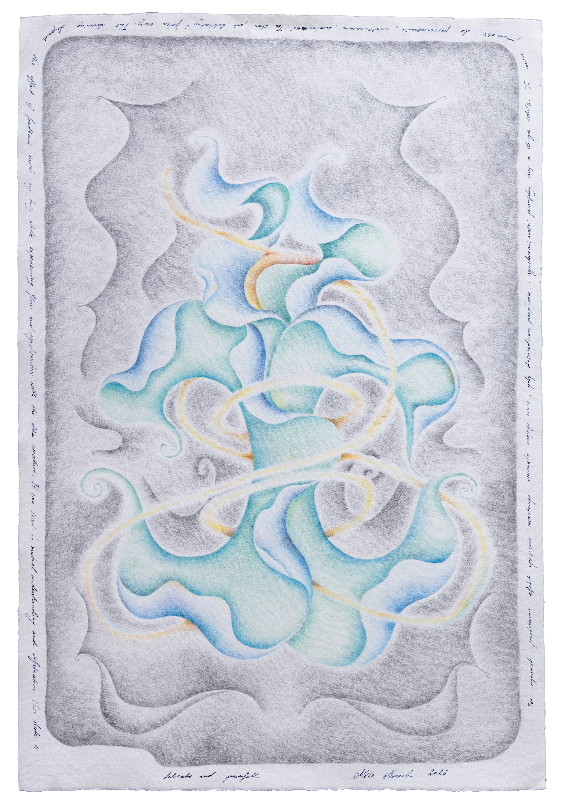
### Description
from Feedback series 
wax-based color pencils on cotton paper
78 x 53 cm 
2024

Bidirectional feedback between the heart and the brain can be recognized through the autonomic nervous system and interoception. Microscopic physiological and emotional connections are often influenced by subtle gestures and situations.

## Urinary system 
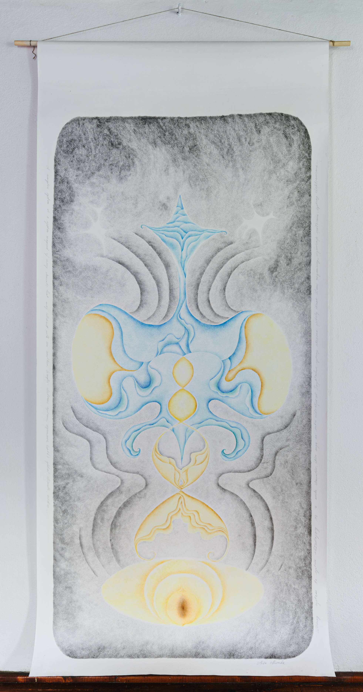
### Description
from Feedback series
wax-based color pencils on paper
200 x 100 cm
2025

This image is a vision of the urinary system. Kidneys are the power center in our body - they play a crucial role in our lives. The kidneys like the warmth. As an infant my son strugled with an issue within his urinary system, grade IV ureteral wall thickening, his kidneys were in danger, because of the constantly recurring inflamations. For several years he was under the care of the doctors of the Center of Mother and Child in Warsaw. Currently he is healthy. 

## Stimulus
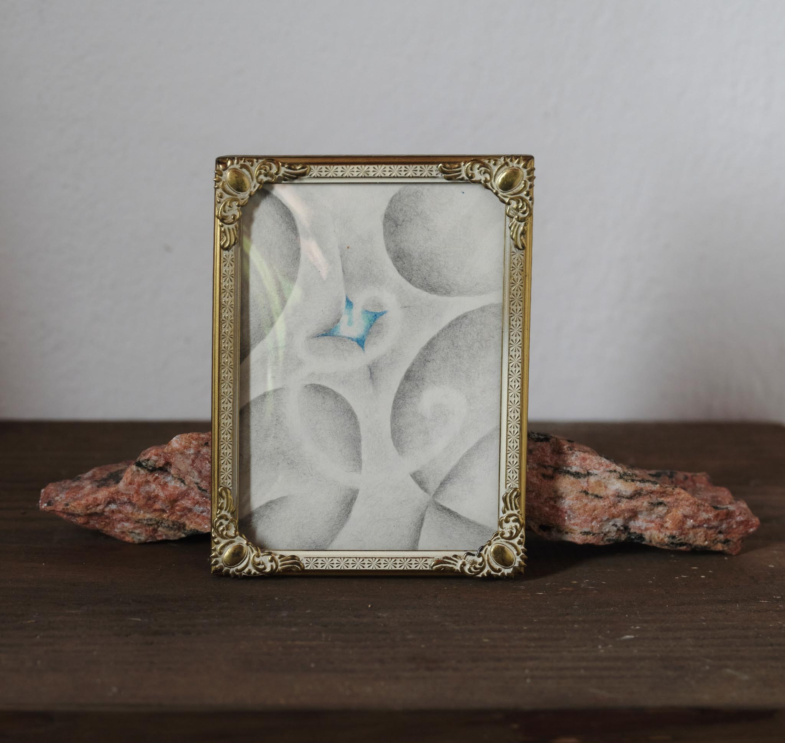
### Description
wax-based color pencils on old paper in vintage photo frame 
11 x 8 cm
2025

## CREATURE stage I
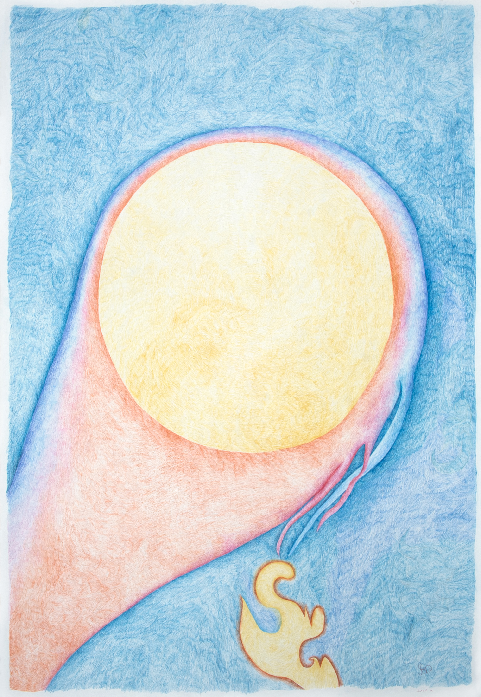
### Description
from Nowelia Kiliani Series 
wax-based colored pencils on cotton paper
100 x 70 cm
2021 

The project Nowelia Kiliani emerged from a personal experience and reinterpretation of the feedback phenomenon, originally associated with electronic audiovisual media but present in every aspect of our planet’s functioning.

The series of works comprising Nowelia Kiliani developed during a period of my psychoanalysis, as an attempt to translate a technical process of feedback into a practice of introspection and inner inquiry. The process began with the observation of feedback in audio-video devices, and gradually shifted toward the observation of my own body, the flow of thoughts, reinterpretation of meanings, and note-taking. In the final stage, these elements were composed into visual forms that most accurately represent internal states. Over time, the forms became increasingly complex, taking on specific characteristics. Throughout the process I recognised the evolution of a new form, which I called the Being and named Nowelia Kiliani. As an accompaniment to the visual works, I created a sound piece - a welcome song for the Being that emerged through this process.

.

## CREATURE stage II
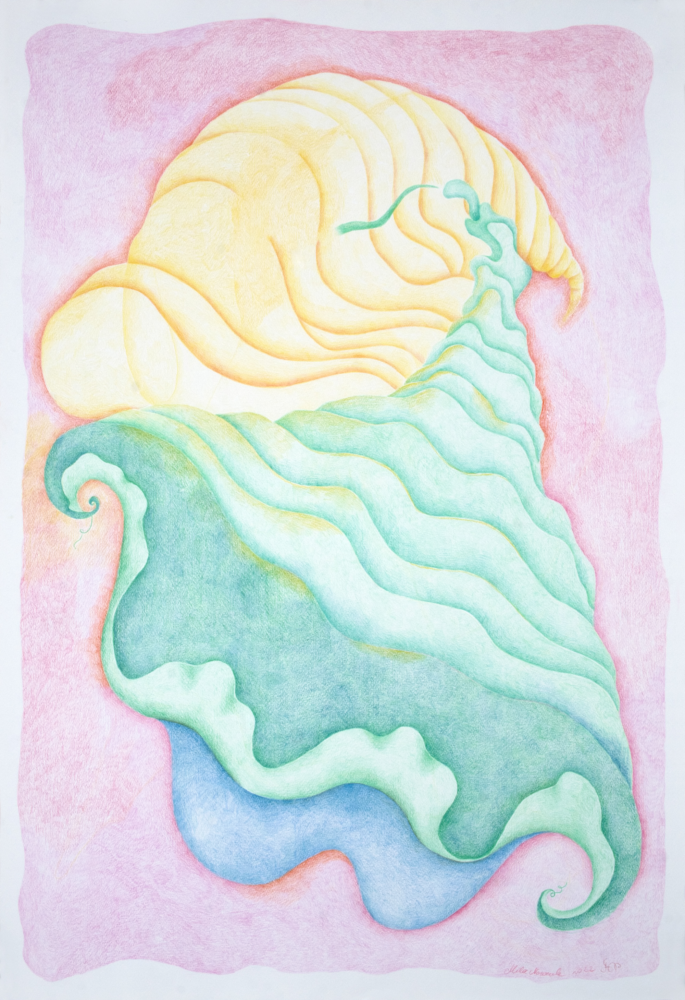
### Description 
from Nowelia Kiliani Series 
wax-based color pencils on cotton paper
100 x 70 cm
2022

The culmination of several years of work on the drawings is an audiovisual album in the form of a book, which includes a lathe-cut vinyl record featuring a flute composition. The publication was completed in 2024 in collaboration with bookbinder Igor Gołaszewski and sound record publisher Sebastian Buczek. The piece was recorded by Aleksander Żurowski, and the sound was then engraved using a modified version of a Polish postcard record cutter from the 1960s, refined by Buczek. Each record was handcrafted. A total of 20 copies of the album were produced. The covers were handprinted at the letterpress workshop of the Academy of Fine Arts in Warsaw.

[Album on Bandcamp](https://milanowacka.bandcamp.com/album/nowelia-kiliani)

## CREATURE stage III
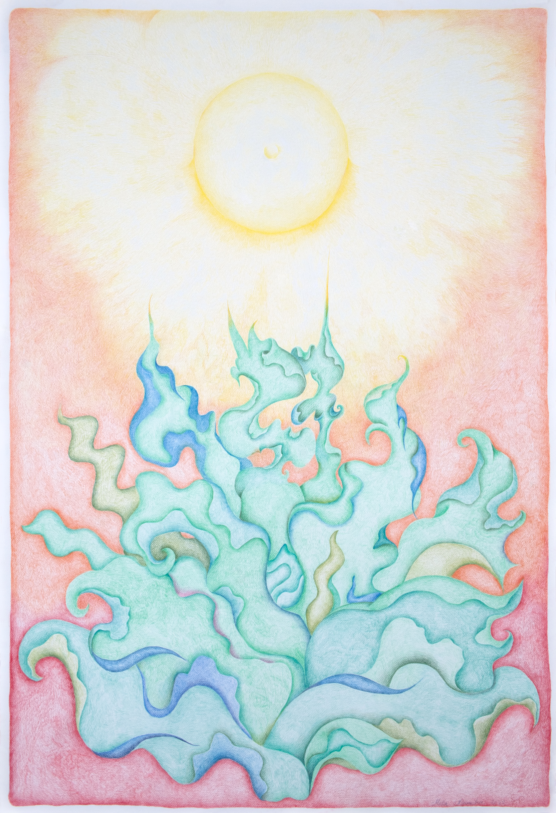
### Description 
from Nowelia Kiliani Series 
[link](https://milanowacka.bandcamp.com/album/nowelia-kiliani)

wax-based color pencils on bristol
100 x 70 cm
2022

## CREATURE stage IV
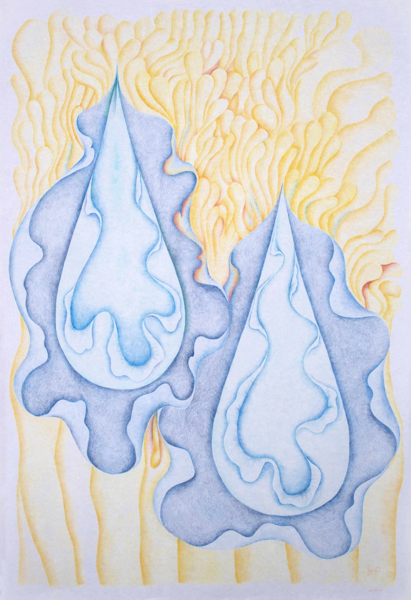
### Description 
from Nowelia Kiliani Series 
[link](https://milanowacka.bandcamp.com/album/nowelia-kiliani)

wax-based color pencils on bristol
100 x 70 cm
2022

## CREATURE stage VI
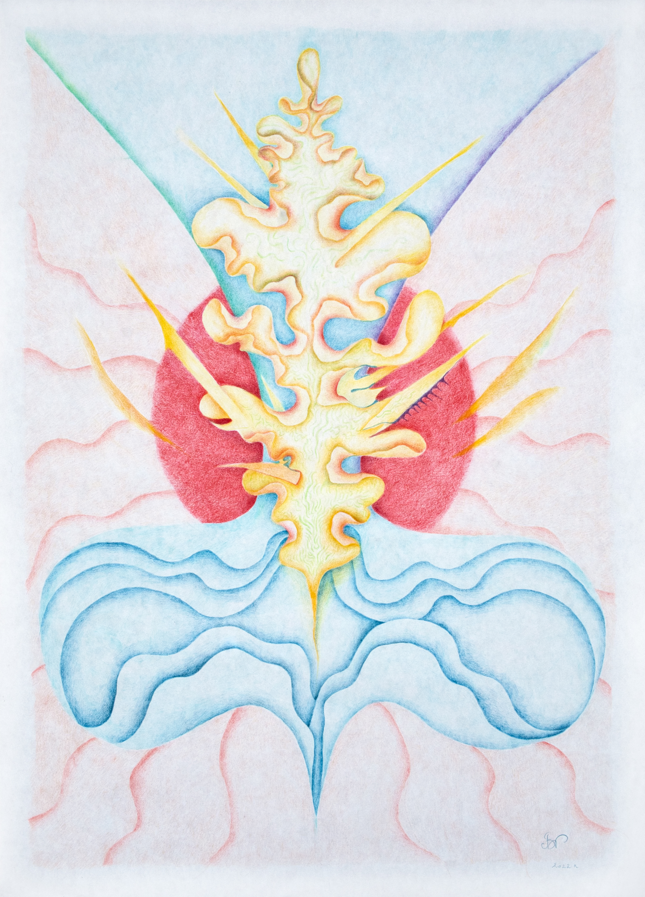
### Description 
from Nowelia Kiliani Series 
[link](https://milanowacka.bandcamp.com/album/nowelia-kiliani)

wax-based color pencils on cotton paper
70 x 50 cm
2023

## CREATURE stage VII
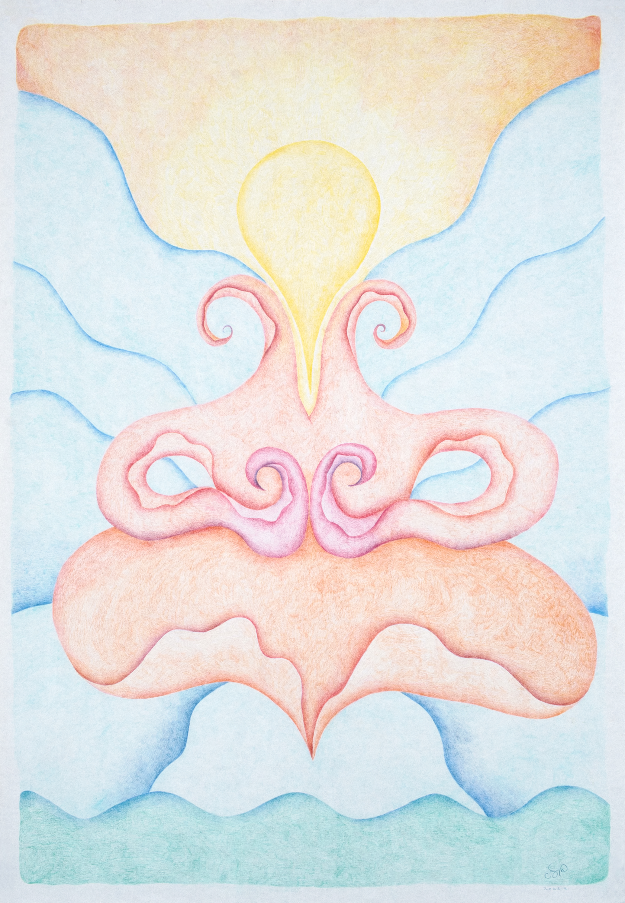
### Description 
from Nowelia Kiliani Series 
[link](https://milanowacka.bandcamp.com/album/nowelia-kiliani)

wax-based color pencils on cotton paper
100 x 70 cm
2023

## CREATURE stage VIII
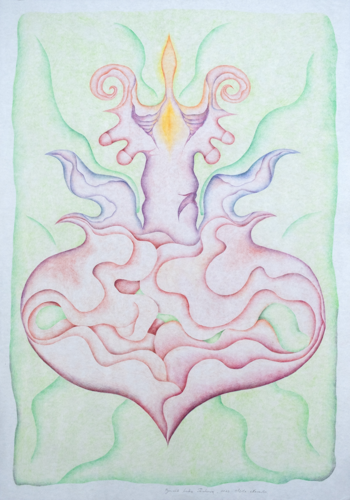
### Description 
from Nowelia Kiliani Series 
[link](https://milanowacka.bandcamp.com/album/nowelia-kiliani)

wax-based color pencils on cotton paper
100 x 70 cm
2023

## CREATURE stage X
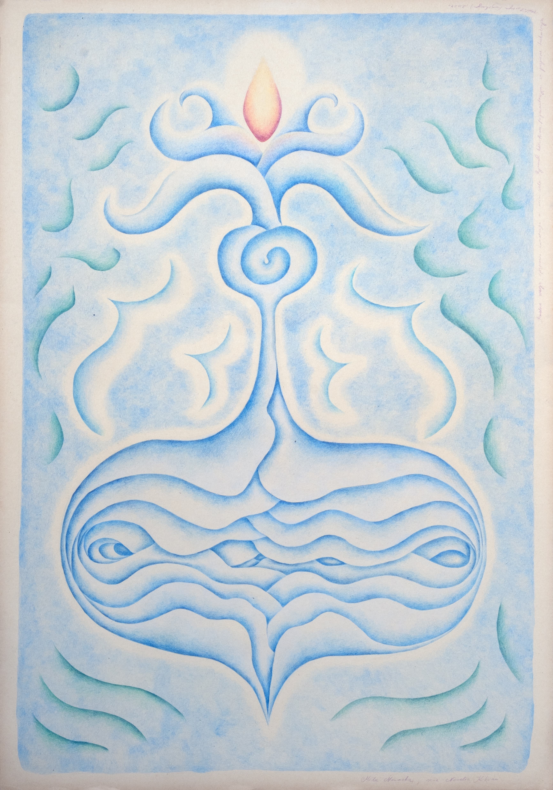
### Description 
from Nowelia Kiliani Series 
[link](https://milanowacka.bandcamp.com/album/nowelia-kiliani)

wax-based color pencils on military technical paper
100 x 70 cm
2024

